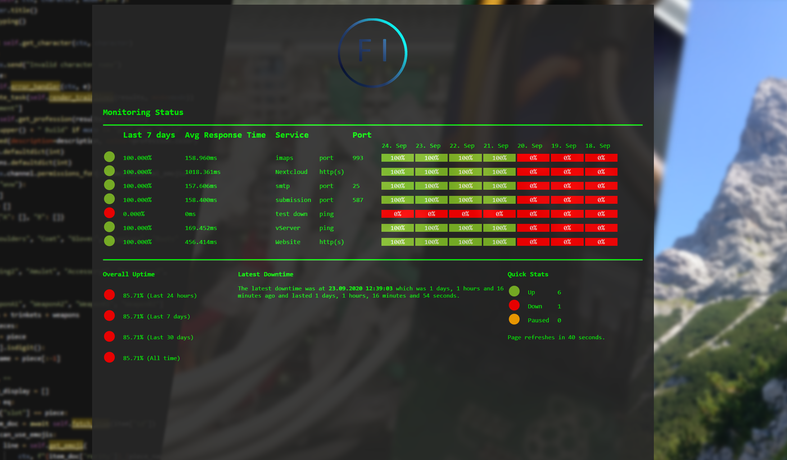

# Introduction
This is a self-hosted dashboard for UptimeRobot using its API for monitoring stuff.
# Example

# Usage
Simply put your API key in the json file and create a vhost in your webserver pointing to this project.
A read-only API key from UptimeRobot is sufficient, you can create it in "My Settings -> Read-Only API Key"